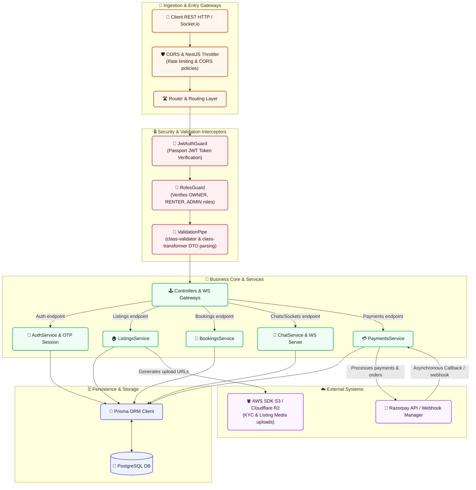

# ⚙️ RentNear Backend API (`apps/api`)

This is the NestJS backend application for RentNear, built with TypeScript, Prisma, and PostgreSQL.

---

## 🔄 Backend Data Flow Diagram

The following diagram illustrates how incoming requests are intercepted, processed, verified, and saved in the storage layer or external services:

## 📂 Key Architecture Modules

### 1. Ingestion, Security & Authorization
- **NestJS Throttler**: Protects controllers against brute-force attacks.
- **Passport JWT**: Extends authentication parsing using custom guards. JWT tokens verify user identities dynamically on secure HTTP endpoints and socket gateways.
- **Roles Guard**: Restricts access based on enum roles (`OWNER`, `RENTER`, `ADMIN`).

### 2. Business Logic Core
- **OTP Login System**: Generates secure OTP logins, hashes them using `bcryptjs` and expires sessions efficiently to prevent spoofing.
- **Listings & Cloudflare R2**: Securely orchestrates document & photo media uploads using pre-signed AWS S3 compatible upload links, bypassing server performance bottlenecks.
- **Real-Time Live Chat Gateway**: Manages stateful WebSocket rooms using Socket.io, persisting messaging histories securely via Prisma.
- **Razorpay Orders & Webhooks**: Triggers orders dynamically and processes asynchronous server signature verifications to complete rental bookings.

---
