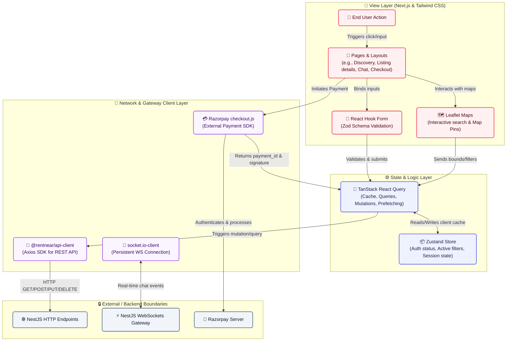

# 🖥️ RentNear Frontend Web App (`apps/web`)

This is the Next.js frontend application for RentNear, built with React, Tailwind CSS, and TypeScript.

---

## 🔄 Frontend Data Flow Diagram

The following diagram illustrates how data flows within the frontend application, starting from a user interaction down to network requests and WebSocket streams:

## 📂 Key Features & Tech Stack

### State Management & Queries
- **Zustand**: Handles simple, global, client-side UI states like drawer states, active filters, user session context, etc.
- **TanStack React Query**: Manages asynchronous server state caching, caching invalidation upon mutations, and automated polling/fetching.

### Interactive Maps
- **Leaflet & React Leaflet**: Powers the geographical listing search. Map pan/zoom triggers coordinates bounds calculations which update the listing search queries dynamically.

### Real-Time Live Chat
- **Socket.io Client**: Connects renters and owners, allowing instant message exchanges, read receipts, and live notification badges.

### Payments
- **React Razorpay**: Handles the payment modal integration directly on the frontend for smooth, fast checkout checkout flows.

---
