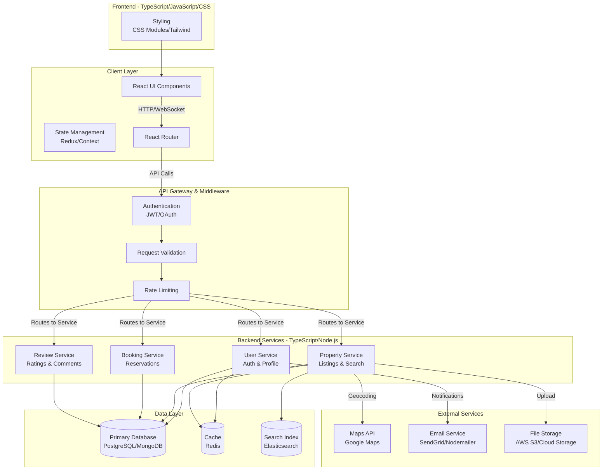
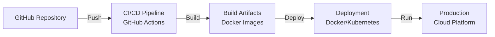

# RentNear - Architecture Overview

## System Architecture

RentNear is a rental property discovery and management platform built with a modern full-stack TypeScript architecture.

## Technology Stack

| Layer | Technology | Language |
|-------|-----------|----------|
| **Frontend** | React | TypeScript (36.5%) |
| **Styling** | CSS Modules/Tailwind | CSS (4.5%) |
| **Runtime** | Node.js | JavaScript (0.5%) |
| **Backend** | Express/Fastify | TypeScript |
| **Database** | PostgreSQL/MongoDB | SQL/NoSQL |
| **Caching** | Redis | - |
| **Search** | Elasticsearch | - |

## Key Components

### Frontend Layer
- **React UI Components**: Reusable component library for property listings, booking flows, and user profiles
- **State Management**: Global state for authentication, user preferences, and search filters
- **Routing**: Client-side routing for seamless navigation between pages
- **Styling**: CSS modules and utility-first CSS framework for responsive design

### API Gateway
- **Authentication**: JWT-based authentication with session management
- **Validation**: Input validation and sanitization for security
- **Rate Limiting**: Prevent abuse and ensure fair resource usage

### Backend Services
- **User Service**: Handles authentication, profile management, and user preferences
- **Property Service**: Manages property listings, search, filtering, and geolocation
- **Booking Service**: Handles reservations, cancellations, and booking history
- **Review Service**: Manages ratings and user reviews

### Data Layer
- **Primary Database**: Persistent storage for users, properties, and bookings
- **Cache**: Redis for session management and frequently accessed data
- **Search Index**: Elasticsearch for fast property search and filtering

### External Services
- **Maps API**: Google Maps for geolocation and property mapping
- **Email Service**: Notifications for bookings, messages, and updates
- **File Storage**: Cloud storage for property images and user avatars

## Data Flow

1. **User Request**: Browser sends HTTP request with optional JWT token
2. **Authentication**: API Gateway validates token and user permissions
3. **Business Logic**: Router directs request to appropriate service
4. **Data Access**: Service queries database and cache layer
5. **Response**: Service returns data, cached for future requests
6. **Client Update**: Frontend updates UI with fresh data

## Deployment Architecture

## Security Considerations

- JWT-based authentication with refresh tokens
- CORS configuration for cross-origin requests
- Input validation and sanitization
- Rate limiting to prevent abuse
- Environment variables for sensitive data
- HTTPS/TLS for all communication

## Performance Optimization

- Caching strategy with Redis for frequently accessed data
- Database indexing for fast queries
- Elasticsearch for full-text search
- Code splitting and lazy loading in React
- Image optimization and compression
- CDN for static assets

---

**Last Updated**: May 22, 2026
